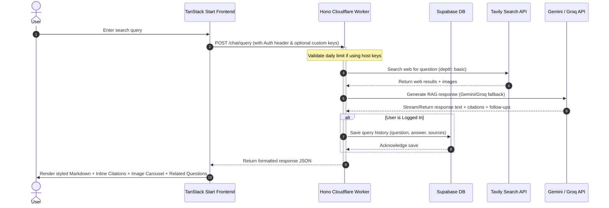

# Queriosity

An elegant, real-time AI-powered search engine and research assistant. Queriosity leverages advanced Retrieval-Augmented Generation (RAG) to provide instant, cited answers to complex queries, complete with source lists, rich media, and smart follow-up suggestions.

<div align="center">

[](https://vite.dev/)
[](https://react.dev/)
[](https://tanstack.com/start/latest)
[](https://tailwindcss.com/)
[](https://www.typescriptlang.org/)
[](https://hono.dev/)
[](https://workers.cloudflare.com/)
[](https://supabase.com/)

</div>

---

## Features

- **Real-Time Web Search**: Backed by Tavily Search API, fetching the latest articles, content, and high-quality images.
- **Hybrid AI Generation & Fallbacks**: Integrated with **Google Gemini** (Gemini 2.5/2.0) and **Groq** (Llama 3.3/3) via Vercel AI SDK. If one provider encounters rate limits or errors, the system seamlessly falls back to the other.
- **Structured Answers with Citations**: Automatic source citation referencing using numbered bracket links (e.g., `[1]`, `[2]`), complete with an interactive bibliography and image carousel.
- **Custom API Key Support**: Bypass public daily usage limits by configuring your own Google Gemini or Groq API keys directly in the settings.
- **Secure User Accounts**: User signup, login, and token-based authentication handled via Supabase Auth.
- **Query History**: Logs previous research queries to Supabase DB, allowing users to revisit past chats.
- **Server-Side Rendering (SSR)**: Powered by TanStack Start and Nitro for ultra-fast load times and optimized client/server communication.

---

## Project Structure

The project is structured as a monorepo consisting of a Hono-based Cloudflare Worker backend and a TanStack Start frontend:

```text
Queriosity/
├── backend/                   # Cloudflare Worker API
│   ├── src/
│   │   ├── db/
│   │   │   └── migrate.ts     # Supabase migrations runner
│   │   ├── middleware/
│   │   │   └── auth.ts        # Supabase auth token validation
│   │   ├── routes/
│   │   │   ├── auth.ts        # Sign up, Login, Profile endpoints
│   │   │   └── chat.ts        # Search & AI Generation endpoints (RAG)
│   │   ├── ai.ts              # AI Provider initialization (Gemini / Groq / Tavily)
│   │   ├── index.ts           # Main Hono entrypoint
│   │   ├── supabase.ts        # Supabase client instantiation
│   │   └── types.ts           # TypeScript Env & binding interfaces
│   ├── wrangler.json          # Cloudflare Wrangler configuration
│   └── supabase-schema.sql    # Database schema definition
│
└── frontend/                  # TanStack Start App
    ├── src/
    │   ├── components/        # Shared UI components (UI library / charts)
    │   ├── routes/
    │   │   ├── __root.tsx     # Layout, Navbar, Settings dialog
    │   │   ├── index.tsx      # Main landing & hero page
    │   │   ├── chat.tsx       # Live search & RAG interaction interface
    │   │   ├── login.tsx      # Authentication (Login)
    │   │   └── signup.tsx     # Authentication (Signup)
    │   ├── router.tsx         # TanStack Router registration
    │   ├── server.ts          # Server entrypoint
    │   └── start.ts           # Client hydration entrypoint
```

---

## Workflow Diagram

The diagram below details the data flow when a user submits a query:



---

## How to Use

### Prerequisites
- Node.js or [Bun](https://bun.sh/) (Recommended)
- A Supabase project
- API Keys: Tavily Search API, Google Gemini, and/or Groq API.

---

### 1. Setting up the Backend

1. Navigate to the backend directory:
   ```bash
   cd backend
   ```
2. Install dependencies:
   ```bash
   bun install
   ```
3. Create a `.dev.vars` file (used for local wrangler development variables) based on `.dev.vars.example`:
   ```env
   SUPABASE_URL=https://your-supabase-project.supabase.co
   SUPABASE_ANON_KEY=your-supabase-anon-key
   SUPABASE_SERVICE_ROLE_KEY=your-supabase-service-role-key
   TAVILY_API_KEY=your-tavily-api-key
   GEMINI_API_KEY=your-gemini-api-key
   GROQ_API_KEY=your-groq-api-key
   CORS_ORIGIN=http://localhost:3000
   ```
4. Run migrations/schema on Supabase using the `supabase-schema.sql` file in your Supabase SQL editor.
5. Start the local worker dev server:
   ```bash
   bun run dev
   ```

---

### 2. Setting up the Frontend

1. Navigate to the frontend directory:
   ```bash
   cd ../frontend
   ```
2. Install dependencies:
   ```bash
   bun install
   ```
3. Create a `.env` file based on `.env.example`:
   ```env
   VITE_API_URL=http://localhost:8787
   ```
4. Start the Vite TanStack Start development server:
   ```bash
   bun run dev
   ```
5. Open your browser and navigate to `http://localhost:3000`.

---

### 3. Deployment

#### Deploy Backend to Cloudflare Workers
```bash
cd backend
bun run deploy
```

#### Deploy Frontend
Compile the production build:
```bash
cd frontend
bun run build
```

---

## Contributors

- **Neel Pandey** - [@N-PCs](https://github.com/N-PCs)

---

## License

This project is licensed under the MIT License - see the [LICENSE](LICENSE) file for details.
